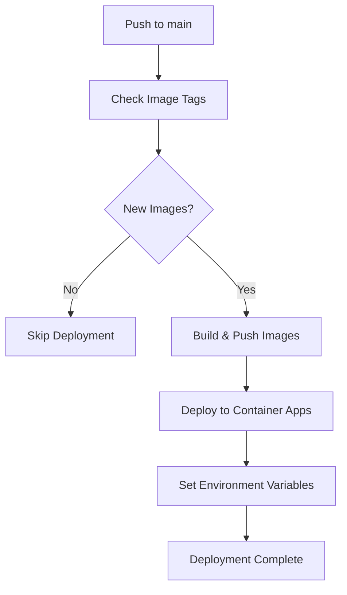

# CI/CD Pipeline Documentation

This directory contains the GitHub Actions workflows for the Rehouzd MVP application's continuous integration and deployment pipeline.

## Current Pipeline Status: **MVP**

The current CI/CD setup is a **Minimum Viable Product** designed to get the application deployed quickly. While functional, it requires significant enhancements for production-grade reliability and best practices.

## Workflow Files

### `azure-deploy-prod.yaml` (Currently Active)
**Purpose:** Simple deployment pipeline for the Container Apps environment

**Triggers:**
- Push to `main` branch

**Current Features:**
- **Smart Version Detection** - Only deploys when new image versions are detected
- **Dual Container Support** - Separate frontend and backend deployments
- **Azure Integration** - Uses OIDC authentication with workload identity
- **Container Registry** - Builds and pushes Docker images to Azure Container Registry
- **Environment Variables** - Configures production environment settings
- **Conditional Deployment** - Skips deployment if no new images

**Current Limitations:**
- **No Testing Phase** - Deploys without running tests
- **No Health Checks** - No verification that services are healthy post-deployment
- **No Rollback Mechanism** - If deployment fails, no automatic recovery
- **Direct Production Deploy** - No staging environment for validation
- **Limited Error Handling** - Basic failure scenarios not covered

### `azure-deploy.yaml` (Template/Disabled)
**Purpose:** Comprehensive deployment pipeline template with production best practices

**Status:** Currently disabled (`branches: none`) - serves as template for future enhancements

**Features Included:**
- **Full Testing Pipeline** - Runs tests before deployment
- **Staging Environment** - Deploy to staging slots for validation
- **Integration Testing** - Health checks on staging environment
- **Manual Approval** - Production environment requires approval
- **Blue-Green Deployment** - Safe slot swapping to production
- **Infrastructure as Code** - Bicep template deployment
- **Proper Error Handling** - Comprehensive failure scenarios covered

## Infrastructure Components

### Azure Resources
- **Container Registry** (`ACR_NAME`) - Stores Docker images
- **Container Apps** - Hosts frontend (`rehouzd-frontend`) and backend (`rehouzd-backend`)
- **Resource Group** (`rehouzd-app`) - Contains all Azure resources
- **Key Vault** (`rehouzd-kv`) - Manages production secrets
- **PostgreSQL** - Database server (managed separately)

### Environment Configuration
- **Frontend App:** `rehouzd-frontend`
- **Backend App:** `rehouzd-backend`
- **Environment:** `rehouzd-env` (Container Apps Environment)
- **Location:** `southcentralus`

## Required GitHub Secrets

```yaml
# Azure Authentication (OIDC)
AZURE_CLIENT_ID: "<service-principal-client-id>"
AZURE_TENANT_ID: "<azure-tenant-id>"
AZURE_SUBSCRIPTION_ID: "<azure-subscription-id>"

# Container Registry
ACR_PASSWORD: "<acr-admin-password>"
```

## Required GitHub Variables

```yaml
# Set in GitHub Repository Settings → Environments → Variables
ACR_NAME: "<container-registry-name>"
ACR_LOGIN_SERVER: "<registry-name>.azurecr.io"
RESOURCE_GROUP: "rehouzd-app"
```

## Current Deployment Flow



## Priority Enhancements Needed

### **Critical Priority (Security & Reliability)**

1. **Add Comprehensive Testing Pipeline**
   ```yaml
   - name: Run Backend Tests
     run: |
       cd backend-server
       npm ci
       npm test
       npm run lint

   - name: Run Frontend Tests
     run: |
       cd frontend-ui
       npm ci
       npm test
   ```

2. **Implement Health Checks**
   ```yaml
   - name: Verify Deployment Health
     run: |
       curl -f ${{ env.BACKEND_URL }}/api/health
       curl -f ${{ env.FRONTEND_URL }}/health
   ```

3. **Add Rollback Mechanism**
   - Automatic rollback on deployment failure
   - Keep previous working image versions
   - Rollback to last known good state

4. **Change Trigger to Main Branch**
   ```yaml
   on:
     push:
       branches:
         - main
   ```

### **High Priority (Production Readiness)**

5. **Implement Staging Environment**
   - Deploy to staging slots first
   - Run integration tests against staging
   - Manual approval for production promotion
   - Blue-green deployment pattern

6. **Add Security Scanning**
   ```yaml
   - name: Run Security Scan
     uses: github/codeql-action/analyze@v2
   
   - name: Scan Docker Images
     uses: anchore/scan-action@v3
   ```

7. **Environment-Specific Deployments**
   - Separate workflows for dev/staging/prod
   - Environment-specific configuration
   - Protected environments with approval requirements

8. **Improve Error Handling**
   - Comprehensive failure scenarios
   - Notification on deployment failures
   - Detailed logging and debugging information

### **Medium Priority (Developer Experience)**

9. **Add Pull Request Validation**
   ```yaml
   on:
     pull_request:
       branches: [main]
   
   jobs:
     validate:
       runs-on: ubuntu-latest
       steps:
         - name: Run Tests
         - name: Build Check
         - name: Security Scan
   ```

10. **Database Migration Support**
    - Automated database schema updates
    - Migration rollback capabilities
    - Database backup before migrations

11. **Performance Testing**
    - Load testing on staging environment
    - Performance regression detection
    - Bundle size analysis for frontend

12. **Enhanced Monitoring**
    - Deployment success/failure metrics
    - Application performance monitoring
    - Error tracking and alerting

### **Low Priority (Optimization)**

13. **Build Optimization**
    - Docker layer caching
    - Parallel build processes
    - Build artifact caching

14. **Multi-Region Deployment**
    - Geographic distribution
    - Disaster recovery setup
    - Cross-region failover

15. **Advanced Features**
    - Feature flag deployment
    - Canary releases
    - A/B testing infrastructure

## Best Practices to Implement

### Security
- [ ] Scan Docker images for vulnerabilities
- [ ] Implement least-privilege access controls
- [ ] Rotate secrets regularly
- [ ] Use signed container images

### Reliability
- [ ] Implement proper retry mechanisms
- [ ] Add circuit breakers for external dependencies
- [ ] Monitor deployment health continuously
- [ ] Maintain deployment rollback procedures

### Observability
- [ ] Structured logging throughout pipeline
- [ ] Metrics collection and alerting
- [ ] Distributed tracing for debugging
- [ ] Performance monitoring and profiling

### Developer Experience
- [ ] Fast feedback loops (< 10 minutes)
- [ ] Clear error messages and debugging info
- [ ] Self-service deployment capabilities
- [ ] Automated dependency updates

## Migration Plan

### Phase 1: Critical Fixes (Week 1-2)
1. Add comprehensive testing pipeline
2. Implement health checks
3. Change trigger to main branch
4. Add basic rollback mechanism

### Phase 2: Production Readiness (Week 3-4)
1. Implement staging environment
2. Add manual approval for production
3. Enhance error handling and logging
4. Add security scanning

### Phase 3: Advanced Features (Month 2)
1. Pull request validation
2. Database migration support
3. Performance testing
4. Enhanced monitoring

### Phase 4: Optimization (Month 3+)
1. Build optimization
2. Multi-region support
3. Advanced deployment strategies

## Troubleshooting

### Common Issues

**Deployment Failures:**
- Check container logs: `az containerapp logs show --name <app-name> --resource-group rehouzd-app`
- Verify environment variables are set correctly
- Ensure secrets are available in Key Vault

**Image Build Failures:**
- Check Dockerfile syntax and dependencies
- Verify base image availability
- Review build logs for specific errors

**Authentication Issues:**
- Verify service principal permissions
- Check OIDC configuration
- Ensure subscription and tenant IDs are correct

**Environment Variable Issues:**
- Verify secret names match Key Vault entries
- Check environment variable mapping in deployment
- Ensure container apps can access Key Vault

### Useful Commands

```bash
# Check deployment status
az containerapp revision list --name rehouzd-frontend --resource-group rehouzd-app

# View application logs
az containerapp logs show --name rehouzd-backend --resource-group rehouzd-app --follow

# Check environment variables
az containerapp show --name rehouzd-frontend --resource-group rehouzd-app --query "properties.template.containers[0].env"

# Manual deployment (emergency)
az containerapp update --name rehouzd-frontend --resource-group rehouzd-app --image <acr-login-server>/rehouzd-frontend:latest
```

## Contributing to Pipeline Improvements

1. **Test changes in feature branch** with modified workflow
2. **Use pull request workflow** for validation
3. **Document all changes** in this README
4. **Test rollback procedures** before merging
5. **Monitor deployment metrics** after changes

For questions about the CI/CD pipeline, create an issue in the repository or reach out to the DevOps team.